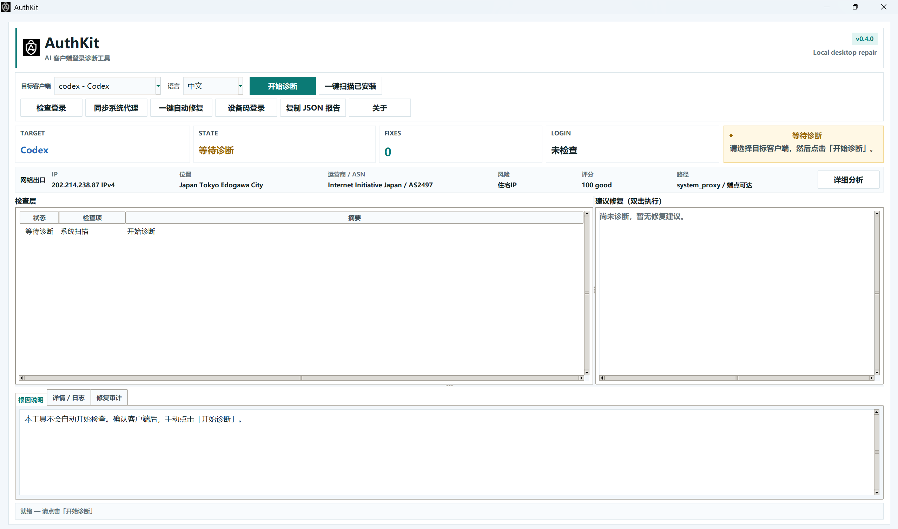

# AuthKit

Diagnose and repair AI client login issues on Windows.

AuthKit is a local Windows tool for field engineers and power users who need to
debug Codex, Claude Code, Gemini, Cursor, or VS Code AI login failures. It checks
login evidence, proxy mismatches, OAuth callback ports, endpoint reachability,
network profile signals, and repair audit records without reading or uploading
token values.

[](https://github.com/rickli0822-prog/AuthKit/actions/workflows/ci.yml)
[](https://github.com/rickli0822-prog/AuthKit/releases/latest)
[](LICENSE)



## Download

For most Windows users, download the installer from the latest release:

- [AuthKit_Setup_0.4.0.exe](https://github.com/rickli0822-prog/AuthKit/releases/download/v0.4.0/AuthKit_Setup_0.4.0.exe) - recommended for field users.
- [AuthKit-0.4.0-windows-portable.zip](https://github.com/rickli0822-prog/AuthKit/releases/download/v0.4.0/AuthKit-0.4.0-windows-portable.zip) - portable GUI and CLI build.

Developers can install from source:

```powershell
python -m pip install -e ".[dev]"
authkit gui
```

## When To Use It

Use AuthKit when a Windows machine shows one of these symptoms:

- Codex, Claude Code, or Gemini appears installed but login still fails.
- The browser login succeeds, but the desktop or CLI client stays logged out.
- The AI client works on one network but fails on a company proxy, VPN, or local proxy setup.
- OAuth callback or localhost ports appear blocked or occupied.
- System proxy, environment proxy, or `NO_PROXY` settings conflict.
- A support engineer needs a redacted evidence bundle instead of screenshots and guesswork.

AuthKit is not a general network benchmark. It focuses on AI client login and
field handoff evidence.

## What It Checks

| Area | What AuthKit Looks For |
| --- | --- |
| Client install | Codex, Claude Code, Gemini, Cursor, and VS Code presence. |
| Login evidence | Local credential markers without printing token values. |
| Network path | AI endpoint reachability, proxy path, public exit facts, and bounded quality signals. |
| OAuth flow | Callback port readiness and local conflicts. |
| Repair state | Proxy, DNS, Winsock, firewall, CA, and rollback audit records. |
| Support handoff | Redacted JSON support bundles and bundle validation. |

Full diagnostic coverage currently targets `codex`, `claude`, and `gemini`.
Cursor and VS Code are handled as partial clients because their stable local
login-state contracts are limited.

## Quick Start

Open the GUI:

```powershell
authkit gui
```

Run a CLI diagnosis:

```powershell
authkit check --client codex
```

Scan installed supported clients:

```powershell
authkit scan
```

Generate a redacted field support bundle:

```powershell
authkit bundle --client codex --out .\authkit-support-bundle.json --fast
```

Validate a support bundle before attaching it to a ticket:

```powershell
authkit bundle --validate .\authkit-support-bundle.json
```

## Safety Boundary

AuthKit is designed for field troubleshooting, so repair actions must be explicit
and auditable:

- It does not upload diagnosis data by default.
- It does not print access tokens, refresh tokens, cookies, passwords, or API keys.
- The installer only installs files and shortcuts; it does not repair system settings.
- Repairs write audit records under `%LOCALAPPDATA%\AuthKit\repair-log.jsonl`.
- Rollback uses AuthKit audit snapshots and requires an explicit `--apply`.

Preview the latest rollbackable repair:

```powershell
authkit rollback --preview
```

Apply rollback only after reviewing the target:

```powershell
authkit rollback --apply
```

## Field Sample Contributions

The fastest way to improve AuthKit is to contribute sanitized failure samples.
If your AI client login fails, create a support bundle and open an issue:

```powershell
authkit bundle --client codex --out .\authkit-support-bundle.json --fast
```

Attach only the redacted bundle. Do not paste raw tokens, cookies, OAuth codes,
corporate proxy passwords, or customer-identifying screenshots.

Useful issue types:

- `Codex login fails after browser authentication`
- `Claude Code works in browser but CLI cannot reach endpoint`
- `Gemini CLI fails only behind company proxy`
- `AuthKit diagnosis misses a real field failure`

See [CONTRIBUTING.md](CONTRIBUTING.md) for the field-sample-first contribution
rules.

## Documentation

- [Support bundle contract](docs/SUPPORT_BUNDLE.md)
- [Windows installer notes](docs/WINDOWS_INSTALLER.md)
- [Foundation readiness](docs/FOUNDATION_READINESS.md)
- [Field sample regression](docs/FIELD_SAMPLE_REGRESSION.md)
- [Diagnosis cases](docs/diagnosis-cases.md)

## Development

```powershell
python -m pip install -e ".[dev]"
python -m pytest -q
python scripts\release_smoke.py
```

Build Windows artifacts:

```powershell
python scripts\build_windows_installer.py
```

The build writes a portable Windows zip under `dist\windows\` and creates
`AuthKit_Setup_<version>.exe` when Inno Setup is installed.

## License

MIT. See [LICENSE](LICENSE).
